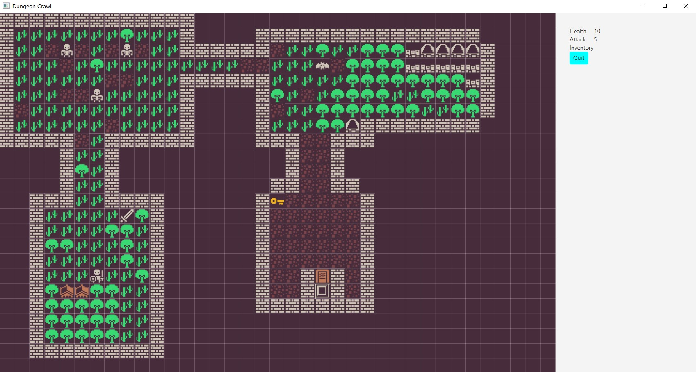
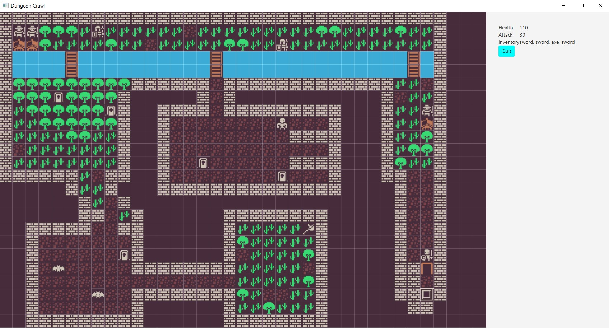
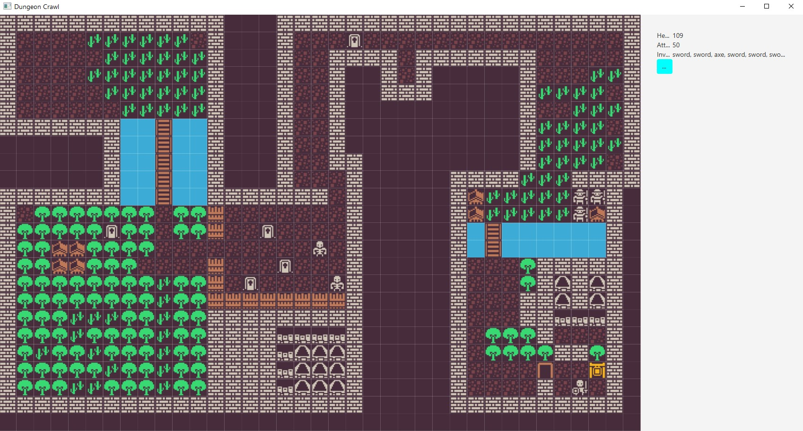

# Dungeon Crawl

> ### Dungeon Crawl is a [Roguelike]((https://en.wikipedia.org/wiki/Roguelike)) game where you can fight different types of monsters ad get a diversity of tools in order to escape the labyrinths of a dungeon.

Roguelike is one of the oldest types of video games, the earliest ones were made in the 70s, they were inspired a lot by tabletop RPGs. Roguelikes have the following in common usually:

- They are tile-based.
- The game is divided into turns, e.g. you make one action, then the other
  entities (monsters, allies, etc. controlled by the CPU) make one.
- Usually the task is to explore a labyrinth and retrieve some treasure from its
  bottom.
- They feature permadeath: if you die its game over, you need to start from the
  beginning again.
- Are heavily using procedural generation: Levels, monster placement, items,..
  are randomized, so the game does not get boring.

## About project
- JavaFX
- Design Patterns
- Object-Oriented Programming
- Code Organisation

## Getting started
### Gameplay
- Start the project using 'Run' feature of Intellij IDE or any of your preferences.
- Attack enemies by going in their direction, pick-up items ny pressing 'Enter'.
- If low on health, go into the taverns to increase your HP.
- Pick up the key to unlock the next room.

### Screenshots

